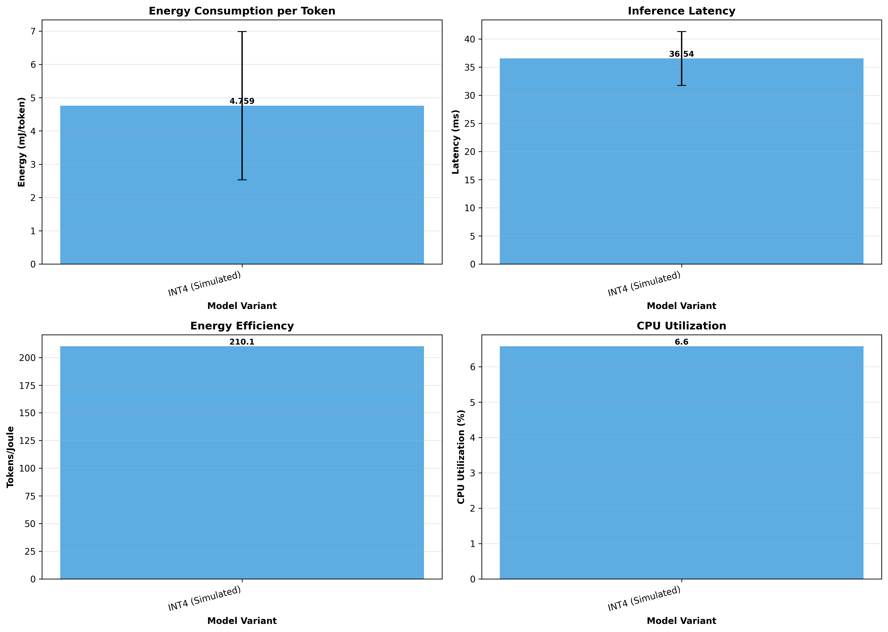
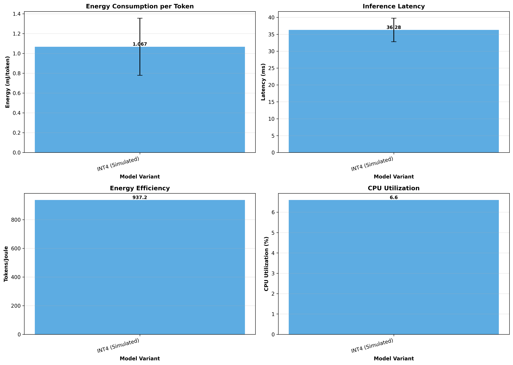
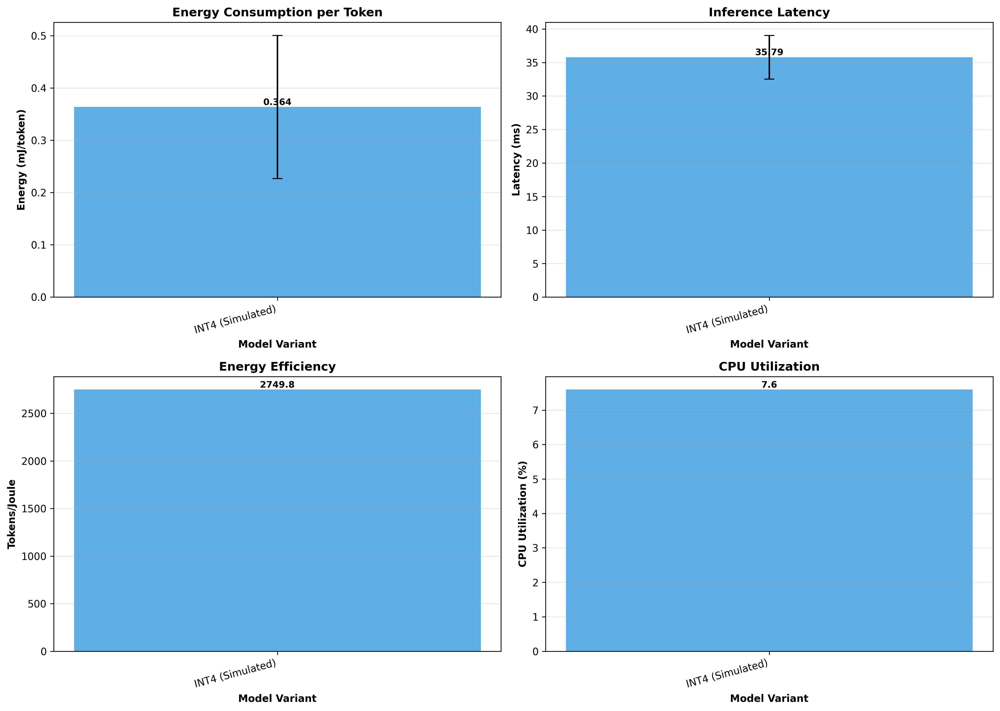

# Phase 6: Power & Efficiency Validation Report

**Generated:** 2025-10-07 18:36:06

---

## Executive Summary

This report presents power consumption and energy efficiency metrics for Itera-Lite across desktop, laptop, and embedded platforms.

## Desktop Platform

### INT4 (Simulated)

#### Power Metrics

- **Energy per Token:** 4.7589 ± 2.2303 mJ
- **Energy per Inference:** 609.1359 ± 285.4830 mJ
- **Energy Efficiency:** 210.1 tokens/Joule

#### Performance Metrics

- **Latency:** 36.54 ± 4.81 ms
- **CPU Utilization:** 6.6 ± 12.2 %
- **Memory Delta:** 0.03 ± 0.14 MB

#### Model Info

- **Parameters:** 293,656
- **Model Size:** 1.12 MB

## Laptop Platform

### INT4 (Simulated)

#### Power Metrics

- **Energy per Token:** 1.0670 ± 0.2884 mJ
- **Energy per Inference:** 136.5822 ± 36.9121 mJ
- **Energy Efficiency:** 937.2 tokens/Joule

#### Performance Metrics

- **Latency:** 36.28 ± 3.49 ms
- **CPU Utilization:** 6.6 ± 9.0 %
- **Memory Delta:** 0.02 ± 0.14 MB

#### Model Info

- **Parameters:** 293,656
- **Model Size:** 1.12 MB

## Embedded Platform

### INT4 (Simulated)

#### Power Metrics

- **Energy per Token:** 0.3637 ± 0.1371 mJ
- **Energy per Inference:** 46.5496 ± 17.5543 mJ
- **Energy Efficiency:** 2749.8 tokens/Joule

#### Performance Metrics

- **Latency:** 35.79 ± 3.25 ms
- **CPU Utilization:** 7.6 ± 12.4 %
- **Memory Delta:** 0.02 ± 0.14 MB

#### Model Info

- **Parameters:** 293,656
- **Model Size:** 1.12 MB

## Visualizations

### Desktop Platform

### Laptop Platform

### Embedded Platform

---

*Report generated on 2025-10-07 at 18:36:06*
